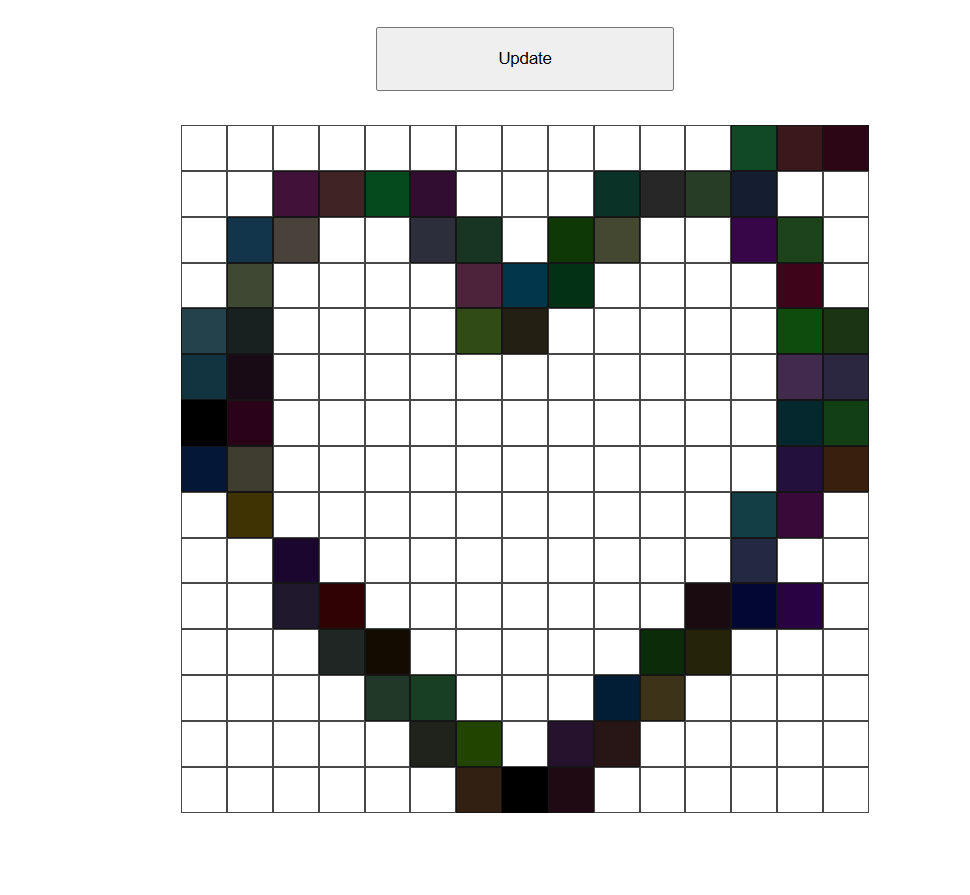

# Etch-a-Sketch

A browser drawing app created for [The Odin Project](https://www.theodinproject.com/) Foundations course.

**Preview**: 

**Live Demo**: [https://wrzdx.github.io/etch-a-sketch/](https://wrzdx.github.io/etch-a-sketch/)

## Project Focus
- DOM manipulation
- Event handling

## Core Features
- Adjustable grid size
- Hover-to-draw functionality
- Color mode toggle
- Reset button

## Key JavaScript Concepts
✅ `querySelector`/`addEventListener`  
✅ Dynamic element creation (`createElement`)  
✅ Event delegation pattern  
✅ Button state management  

## How to Run
1. `git clone https://github.com/wrzdx/etch-a-sketch.git`
2. open `index.html` by browser

